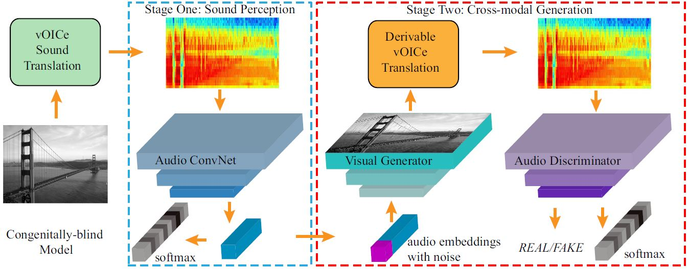
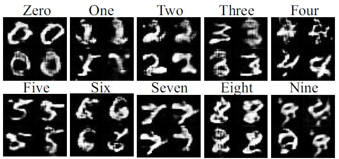

# Listen to the Image

This repository provides a kind of congenitally-blind model, implemented in Keras with tensorflow backend.
For more details about this model, please see our paper [Listen to the Image](http://dtaoo.github.io/papers/2019_voice.pdf) by Di Hu, Dong Wang et al, CVPR 2019.

## The Congenitally-Blind Model:


The image and vOICe translator outside the dashed boxes represent the circumstance of blindness with Sensory Substitution devices, while the two-stage model within the boxes consists of preliminary sound embedding and cross-modal generative adversarial perception.

## Cross-modal Perception

Taking the handwritten digits perception as an example. 

### Step one: 

Modeling the translated sound via a classification task, then using the extracted embeddings as the conditional input to cross-modal generation. To start this, just do

```bash
$ python audio_embedding_extractor_mnist.py
```

The extracted embeddings are saved in `audio_embeddings/` for the second-step processing.

### Step two: 

A novel cross-modal GAN is utilized to compare the generated visual image and the original translated sound, where the visual generator takes the audio embeddings as the conditional input and the audio discriminator takes the softmax regression as an auxiliary classifier. To start this, just do

```bash
$ python CBM_voice_mnist.py 
```

The generated images can be found in  `gen_mnist/`. Note that, the visual model had never seen any real-images, just their translated sounds.


## Imagined visual objects by 'hearing' 



